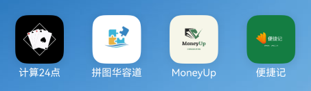

# 重庆大学移动应用软件开发课程实验与项目代码

本仓库包含重庆大学2024年秋移动应用软件开发课程的实验与项目代码，基于 **HarmonyOS** 开发，采用 **前后端分离架构** 实现。实验包括 **计算24点APP**、**拼图游戏APP**、**记账APP**，课程项目为 **记事簿APP**。后端使用 **Spring Boot**、**MyBatis Plus** 和 **MySQL**。希望与学习移动应用开发的朋友共同进步，也欢迎对项目提出改进建议！

---

## 快速导航

- [HarmonyOS App Development: 重庆大学移动应用软件开发课程实验与项目代码](#harmonyos-app-development-重庆大学移动应用软件开发课程实验与项目代码)
  - [快速导航](#快速导航)
  - [技术栈与版本兼容性](#技术栈与版本兼容性)
    - [前端](#前端)
    - [后端](#后端)
  - [实验与项目内容](#实验与项目内容)
    - [实验一：扑克牌计算24点APP](#实验一扑克牌计算24点app)
    - [实验二：拼图游戏APP](#实验二拼图游戏app)
    - [实验三：收支记账APP](#实验三收支记账app)
    - [课程项目：记事簿APP](#课程项目记事簿app)

---

## 技术栈与版本兼容性

> 在使用本仓库代码时，请留意以下**前后端版本兼容性**，确保环境配置正确。

### 前端

详细信息见[HarmonyOS 5.0.0 Release版本说明](https://developer.huawei.com/consumer/cn/doc/atomic-releases-V5/atomic-releasenotes-V5)

| 核心组件            | 版本                      | 说明                                |
| ------------------- | ------------------------ | --------------------------------- |
| **HarmonyOS**        | 5.0.0 Release             | HarmonyOS操作系统版本             |
| **DevEco Studio**    | 5.0.0 Release             | 开发工具，使用DevEco Studio开发   |
| **HarmonyOS SDK**    | 5.0.0 Release SDK         | HarmonyOS SDK版本，基于OpenHarmony SDK Ohos_sdk_public 5.0.0.71 |
| **OpenHarmony API Version** | 12 Release               | OpenHarmony API版本              |

### 后端

| 核心组件            | 版本                      | 说明                                |
| ------------------- | ------------------------ | --------------------------------- |
| **IntelliJ IDEA**    | 2024.2                    | 后端开发IDE                       |
| **OpenJDK**          | 1.8.0                     | Java开发包，运行Java代码必备       |
| **Spring Boot**      | 2.6.13                    | 核心框架，构建后端服务              |
| **Maven**            | 3.6.3                     | 项目构建管理工具，管理项目依赖与构建流程 |
| **MyBatis Plus**     | 3.5.7                     | 数据持久层框架，简化 MyBatis 的开发 |
| **Druid**            | 1.2.16                    | 数据库连接池，提供监控和性能优化   |
| **Lombok**           | 最新                       | 简化Java代码，减少样板代码         |
| **Velocity Engine**  | 2.3                       | 模板引擎，用于生成代码或模板内容   |

---

## 实验与项目内容

>ps：实验一与实验二牵扯到较少的数据处理，故对后端的需求不多，可以不运行后端程序即可完成课程所要求的实验内容。而实验三与课程项目尤其注重数据处理，前端的正常展示强烈依赖于后端程序的正常运行，故不能单拿这两款APP的前端代码来完成实验任务。

---

### 实验一：扑克牌计算24点APP

**APP名称**：计算24点  
**核心功能**：

- 展示52张扑克牌（必需）
- 点击选择4张扑克牌并放置在界面（必需）
- 若可计算出24，展示所有可能的计算结果；若不可计算出，给出提示（必需）

**其他功能**：

- 登录（非必需，需后端）
- 注册（非必需，需后端）

---

### 实验二：拼图游戏APP

**APP名称**：拼图华容道  
**核心功能**：

- 展示多张供选择的图片（必需）
- 选择其中一张图片，分割成小图片并在其上标记数字，可选择不显示（必需）
- 计时器功能：开始、暂停、重置（必需）
- 点击图片进行移动，自动判断游戏是否完成（必需）
- 步数记录（必需）
  
**其他功能**：

- 展示游戏指南（非必需）
- 选择游戏等级（非必需）
- 游戏帮助（非必需）
- 登录（非必需，需后端）
- 注册（非必需，需后端）
- 计分（非必需，需后端）
- 排行榜（非必需，需后端）

---

### 实验三：收支记账APP

**APP名称**：MoneyUp  
**特别注意**：本实验多页面而且数据存储与处理由后端完成，所有功能的实现依赖于后端。

**核心功能**：

- **流水页面**：显示收支流水记录，支持侧滑删除和用户搜索查询（必需）
- **记账页面**：记录收入与支出数据，包括金额、用途、日期、分类、备注等（必需）
- **报表页面**：按年、月、日选择可视化展示收支情况（必需）

**其他功能**：

- **个人页面**：展示用户信息，支持修改密码、退出登录等（非必需）
- **登录与注册页面**：提供登录与注册功能（非必需）

---

### 课程项目：记事簿APP

**APP名称**：便捷记  
**特别注意**：本课程项目多页面而且数据存储与处理由后端完成，所有功能的实现依赖于后端。
**拥有的功能**：

- **登录与注册页面**：支持在线模式（联网，数据保存在云端）和离线模式（本地使用，不需要账号和联网）
- **主页**：展示笔记列表，支持笔记筛选（分类、收藏）、搜索（标题、正文、分类、日期），以及侧滑管理（置顶、分类、收藏、删除）
- **新建笔记页面**：输入标题、正文，选择分类，显示时间和字数，支持回撤与复原操作
- **编辑笔记页面**：比新建笔记页面多了收藏与删除功能，支持新建与自定义分类
- **回收站页面**：展示已删除的笔记，并提供恢复与彻底删除选项
- **设置页面**：修改头像、昵称、密码，支持退出登录等
